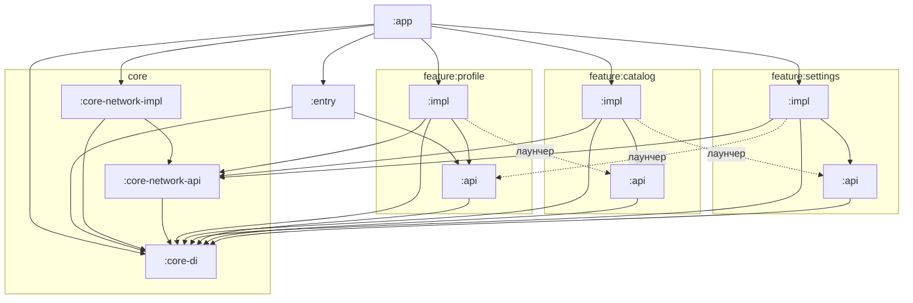
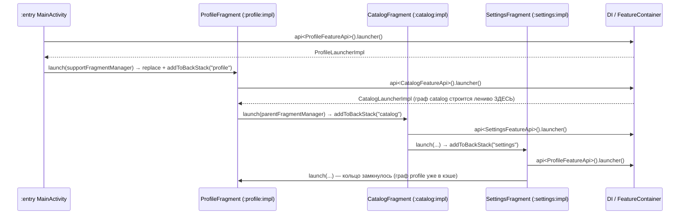
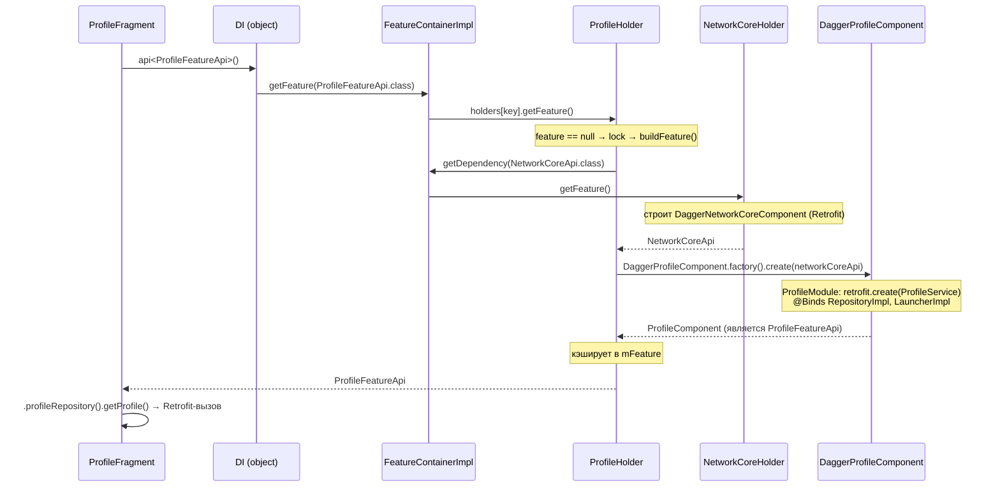

# Архитектура DaggerTest

Учебная реализация DI-архитектуры крупного мультимодульного Android-приложения:
кастомный сервис-локатор поверх Dagger 2 — `FeatureApi` + `FeatureHolder` +
`Map<Class, FeatureHolder>` + `DI.getFeature()`.

---

## 1. Принципы

1. **api/impl split** — каждая фича и каждый core-сервис = пара Gradle-модулей:
   - `:api` — публичный контракт: доменные модели, интерфейс репозитория,
     лаунчер, `XxxFeatureApi`. Ни одной реализации.
   - `:impl` — всё остальное: data-слой (Retrofit service / DTO / RepositoryImpl),
     presentation (Fragment / ViewModel), DI (Component / Holder / Module),
     навигация (LauncherImpl).
2. **У каждой фичи свой Dagger-граф** (`@PerFeature @Component`), изолированный
   от остальных. Единого монолитного компонента с реализациями экранов нет.
3. **Модули общаются только через `:api`** — ни одна фича не зависит от чужого
   `:impl`. `:impl` видит только `app` (агрегатор).
4. **Зависимости между графами** — через `@Component(dependencies = [ЧужойApi])`
   и `FeatureContainer.getDependency()`.
5. **Ленивая инициализация** — граф фичи строится при первом обращении и
   кэшируется в холдере.
6. **В `:app` нет логики** — только сборка мапы холдеров и `DI.initialize()`.
   UI-хост (`MainActivity`) вынесен в `:entry`.

---

## 2. Карта модулей

Физически модули лежат в директориях `CORE/` и `FEATURE/`, а **Gradle-имена у них
плоские** (`core-network-api`, `feature-profile-impl`, …). Маппинг «имя → путь»
задаётся в `settings.gradle.kts` через `projectDir`:

```kotlin
fun includeModule(name: String, path: String) {
    include(":$name")
    project(":$name").projectDir = File(rootDir, path)
}
// директории <dirPrefix>-api / <dirPrefix>-impl, без промежуточной папки-группы
fun includeApiImplModules(namePrefix: String, dirPrefix: String) {
    includeModule("$namePrefix-api", "$dirPrefix-api")
    includeModule("$namePrefix-impl", "$dirPrefix-impl")
}

includeModule("core-di", "CORE/di")
includeModule("core-designsystem", "CORE/designsystem")     // leaf UI-библиотека (один модуль)
includeApiImplModules("core-network", "CORE/network")       // → CORE/network-api, CORE/network-impl
includeApiImplModules("core-deeplink", "CORE/deeplink")
includeApiImplModules("core-workflow", "CORE/workflow")
includeApiImplModules("feature-profile", "FEATURE/profile")
includeApiImplModules("feature-catalog", "FEATURE/catalog")
includeApiImplModules("feature-settings", "FEATURE/settings")
```

```
DaggerTest
├── app                  # :app — DI-сборка: App, AppComponent, AppHolderModule. Логики нет.
├── entry                # :entry — UI-хост: MainActivity (запускает первую фичу её лаунчером)
├── CORE
│   ├── di               # :core-di — каркас: FeatureApi, FeatureHolder, FeatureContainer, DI, @PerFeature
│   ├── designsystem     # :core-designsystem — leaf UI-lib: токены/стили + ds_*.xml + DesignSystemInflater (см. designsystem/README.md)
│   ├── network-api      # :core-network-api — NetworkCoreApi (отдаёт Retrofit)
│   ├── network-impl     # :core-network-impl — NetworkModule, NetworkCoreComponent/Holder
│   ├── deeplink-api     # :core-deeplink-api — контракты диплинков (см. deeplink-impl/DEEPLINK.md)
│   ├── deeplink-impl    # :core-deeplink-impl — движок диплинков + DeeplinkActivity
│   ├── workflow-api     # :core-workflow-api — контракты Server-Driven UI (см. workflow-impl/WORKFLOW.md)
│   └── workflow-impl    # :core-workflow-impl — SDUI-движок + рендер через дизайн-систему
└── FEATURE
    ├── profile-api      # :feature-profile-api — Profile, ProfileRepository, ProfileLauncher, ProfileFeatureApi
    ├── profile-impl     # :feature-profile-impl — data/ di/ navigation/ presentation/
    ├── catalog-api      # :feature-catalog-api
    ├── catalog-impl     # :feature-catalog-impl
    ├── settings-api     # :feature-settings-api
    └── settings-impl    # :feature-settings-impl
```

В `dependencies { }` модулей используются **плоские имена**:
`implementation(project(":core-network-api"))`, `api(project(":feature-profile-api"))` и т.д.
Windows-нюанс: имена `CORE`/`core` на NTFS не различаются, поэтому старые
директории нельзя держать рядом с новыми.

### Граф зависимостей Gradle-модулей



Пунктир — навигационные зависимости (profile → catalog → settings → profile,
кольцо). Цикла в Gradle нет, потому что все рёбра ведут в `:api`, а `:api`
ни от каких фич не зависит.

### Таблица зависимостей (dependencies в build.gradle.kts)

| Модуль | Зависит от | Замечание |
|---|---|---|
| `:core-di` | dagger (annotations) | каркас, ни от кого в проекте не зависит |
| `:core-network-api` | `:core-di`, `api(retrofit)` | `api(retrofit)` — тип Retrofit часть контракта |
| `:core-network-impl` | **`api(:core-network-api)`**, `:core-di`, retrofit+gson+okhttp-logging, dagger+kapt | `api(...)` — `NetworkCoreApi` нужен kapt-у `:app` для `@ClassKey` |
| `:feature-X-api` | `:core-di`, `api(fragment-ktx)` | fragment-ktx — тип `FragmentManager` в лаунчере |
| `:feature-X-impl` | **`api(:feature-X-api)`**, `:core-di`, `:core-network-api`, `:feature-Y-api` (сосед для навигации), androidx/coroutines/retrofit, dagger+kapt | |
| `:entry` | `:core-di`, `:feature-profile-api`, appcompat | стартует первую фичу |
| `:app` | `:entry`, `:core-di`, все `:impl`, material, dagger+kapt | единственный, кто видит impl-ы |

**Правило `api(...)` vs `implementation(...)`:** если тип из модуля A встречается
в публичных сигнатурах модуля B (наследование `FeatureApi`, `@ClassKey`,
возвращаемые типы) — B обязан подключать A через `api(project(...))`, иначе
потребители B не увидят тип (kapt `:app` падал именно на этом).

### Core-модули: deeplink, workflow, designsystem

Помимо `core-network`, есть ещё три ядра — у каждого свой подробный док (этот файл их не
дублирует):

- **`core-deeplink`** — обработка диплинков (chain-of-responsibility шаги через
  Dagger-мультибиндинги, лениво). Подробно: `CORE/deeplink-impl/DEEPLINK.md`.
- **`core-workflow`** — Server-Driven UI: сервер описывает экран JSON, движок его рендерит и
  гоняет цикл «событие → следующий экран». Подробно: `CORE/workflow-impl/WORKFLOW.md`.
- **`core-designsystem`** — leaf UI-библиотека (как `material`, без DI/холдера): токены,
  стили и `ds_*.xml`-компоненты + `DesignSystemInflater` (инфлейт по семантическому ключу).
  Первый потребитель — рендер `core-workflow`. Подробно: `CORE/designsystem/README.md`.

`core-deeplink` и `core-workflow` следуют тому же `api/impl` + `FeatureHolder` паттерну, что и
`core-network`; оба собирают вклады фич (`@IntoSet`) в `AppComponent` и прокидывают их в свой
лист-компонент через `@BindsInstance`.

---

## 3. Каркас `:core-di`

Пакет `az.less.core.di`.

### `FeatureApi.kt`
```kotlin
interface FeatureApi
```
Маркер публичного API фичи. Наследник (`ProfileFeatureApi`) служит одновременно
**ключом** мапы холдеров и **типом значения**, которое отдаётся наружу.

### `FeatureHolder.kt`
```kotlin
interface FeatureHolder<out T : Any> {
    fun getFeature(): T
}
```

### `BaseFeatureHolder.kt`
```kotlin
abstract class BaseFeatureHolder<T : Any>(
    private val container: FeatureContainer,
) : FeatureHolder<T> {
    private val lock = ReentrantLock()
    @Volatile private var feature: T? = null

    final override fun getFeature(): T {
        feature?.let { return it }                       // быстрый путь — кэш
        return lock.withLock {
            feature ?: buildFeature().also { feature = it }   // ленивое создание
        }
    }

    protected fun <D : Any> getDependency(key: Class<D>): D =
        container.getDependency(key)                     // чужой Api из контейнера

    protected abstract fun buildFeature(): T             // сборка Dagger-графа
}
```
Ленивость + потокобезопасность (double-checked locking) + кэш. `getDependency()` —
единственный способ фичи получить чужой Api при сборке своего графа.

### `FeatureContainer.kt`
```kotlin
interface FeatureContainer {
    fun <T : Any> getFeature(key: Class<T>): T       // для бизнес-логики
    fun <T : Any> getDependency(key: Class<T>): T    // при построении графа
}
```
В полноценной реализации методы различаются (второй — точка диагностики
циклических зависимостей); в нашей упрощённой версии они эквивалентны.

### `FeatureContainerImpl.kt`
```kotlin
class FeatureContainerImpl : FeatureContainer {
    private var holders: Map<Class<*>, FeatureHolder<*>> = emptyMap()

    fun init(holdersProvider: (FeatureContainer) -> Map<Class<*>, FeatureHolder<*>>): FeatureContainerImpl {
        holders = holdersProvider(this)   // разрыв цикла «контейнер ↔ холдеры»
        return this
    }

    override fun <T : Any> getFeature(key: Class<T>): T = resolve(key)
    override fun <T : Any> getDependency(key: Class<T>): T = resolve(key)

    private fun <T : Any> resolve(key: Class<T>): T {
        val holder = holders[key] ?: error("No FeatureHolder registered for ${key.name}")
        return holder.getFeature() as T
    }
}
```
`init` принимает лямбду, потому что холдерам нужен контейнер (для
`getDependency`), а контейнеру — холдеры: классическая взаимная ссылка,
разрывается отложенной инициализацией.

### `DI.kt`
```kotlin
object DI {
    @Volatile private var container: FeatureContainer? = null
    fun initialize(featureContainer: FeatureContainer) { container = featureContainer }
    fun <T : Any> getFeature(key: Class<T>): T =
        (container ?: error("DI is not initialized...")).getFeature(key)
}

inline fun <reified T : Any> api(): T = DI.getFeature(T::class.java)
```
Статический фасад. Использовать там, куда нельзя инжектить конструктором
(Activity/Fragment); внутри графов — только `Component.dependencies`.

### `PerFeature.kt`
```kotlin
@Scope @MustBeDocumented @Retention(AnnotationRetention.RUNTIME)
annotation class PerFeature
```
Scope графа фичи: объект живёт, пока жив закэшированный в холдере инстанс.

---

## 4. Core-фича: `:core-network`

Паттерн **идентичен** фичам — core и feature устроены одинаково,
различаются только временем жизни (global vs session).

### `:core-network-api` — `NetworkCoreApi.kt`
```kotlin
interface NetworkCoreApi : FeatureApi {
    fun retrofit(): Retrofit
}
```

### `:core-network-impl`

`NetworkModule.kt` — сборка стека:
```kotlin
@Module
internal object NetworkModule {
    private const val BASE_URL = "https://example.com/api/"

    @Provides @PerFeature
    fun provideOkHttpClient(): OkHttpClient = OkHttpClient.Builder()
        .addInterceptor(HttpLoggingInterceptor().apply { level = BASIC })
        .build()

    @Provides @PerFeature
    fun provideRetrofit(client: OkHttpClient): Retrofit = Retrofit.Builder()
        .baseUrl(BASE_URL).client(client)
        .addConverterFactory(GsonConverterFactory.create())
        .build()
}
```

`NetworkCoreComponent.kt` — лист графа (ни от кого не зависит); **сам компонент
реализует Api**:
```kotlin
@PerFeature
@Component(modules = [NetworkModule::class])
internal interface NetworkCoreComponent : NetworkCoreApi {
    @Component.Factory interface Factory { fun create(): NetworkCoreComponent }
}
```

`NetworkCoreHolder.kt`:
```kotlin
internal class NetworkCoreHolder(container: FeatureContainer) :
    BaseFeatureHolder<NetworkCoreApi>(container) {
    override fun buildFeature(): NetworkCoreApi =
        DaggerNetworkCoreComponent.factory().create()
}
```

`NetworkCoreHolderModule.kt` — регистрация в общую мапу:
```kotlin
@Module
interface NetworkCoreHolderModule {
    companion object {
        @Provides @Singleton @IntoMap @ClassKey(NetworkCoreApi::class)
        fun provideNetworkCoreHolder(container: FeatureContainer): FeatureHolder<*> =
            NetworkCoreHolder(container)
    }
}
```

---

## 5. Анатомия фичи (на примере profile)

Все три фичи устроены одинаково; различия — в таблице ниже.

### `:feature-profile-api` (4 файла)

```kotlin
// Profile.kt — доменная модель
data class Profile(val name: String, val email: String)

// ProfileRepository.kt — доменный контракт
interface ProfileRepository { suspend fun getProfile(): Profile }

// ProfileLauncher.kt — точка входа в фичу (у КАЖДОЙ фичи свой, общего модуля нет)
interface ProfileLauncher { fun launch(fragmentManager: FragmentManager) }

// ProfileFeatureApi.kt — публичное API (= ключ и значение в контейнере)
interface ProfileFeatureApi : FeatureApi {
    fun launcher(): ProfileLauncher
    fun profileRepository(): ProfileRepository
}
```

### `:feature-profile-impl` (4 пакета)

**`data/`** — реализация на Retrofit:
```kotlin
// ProfileService.kt
internal interface ProfileService {
    @GET("profile") suspend fun fetchProfile(): ProfileDto
}
internal data class ProfileDto(val name: String?, val email: String?)

// ProfileRepositoryImpl.kt — @Inject constructor, оффлайн-заглушка при ошибке сети
internal class ProfileRepositoryImpl @Inject constructor(
    private val service: ProfileService,
) : ProfileRepository {
    override suspend fun getProfile(): Profile = try {
        val dto = service.fetchProfile()
        Profile(dto.name.orEmpty(), dto.email.orEmpty())
    } catch (e: Exception) {
        Profile("Мир Рашад (оффлайн-заглушка)", "mirrashadhasanov@gmail.com")
    }
}
```

**`navigation/`** — стартовая логика фичи:
```kotlin
// ProfileLauncherImpl.kt — инжектится в граф, знает СВОЙ Fragment
internal class ProfileLauncherImpl @Inject constructor() : ProfileLauncher {
    override fun launch(fragmentManager: FragmentManager) {
        fragmentManager.beginTransaction()
            .replace(android.R.id.content, ProfileFragment())
            .addToBackStack("profile")
            .commit()
    }
}
```

**`di/`** — собственный граф:
```kotlin
// ProfileModule.kt — биндинги data-слоя и лаунчера
@Module
internal interface ProfileModule {
    @Binds @PerFeature fun bindLauncher(impl: ProfileLauncherImpl): ProfileLauncher
    @Binds fun bindRepository(impl: ProfileRepositoryImpl): ProfileRepository
    companion object {
        @Provides @PerFeature
        fun provideService(retrofit: Retrofit): ProfileService =
            retrofit.create(ProfileService::class.java)   // ← Retrofit пришёл из NetworkCoreApi
    }
}

// ProfileComponent.kt — граф фичи; dependencies = чужие Api; компонент = Api фичи
@PerFeature
@Component(dependencies = [NetworkCoreApi::class], modules = [ProfileModule::class])
internal interface ProfileComponent : ProfileFeatureApi {
    @Component.Factory interface Factory {
        fun create(networkCoreApi: NetworkCoreApi): ProfileComponent
    }
}

// ProfileHolder.kt — ленивая сборка; чужой Api достаётся из контейнера
internal class ProfileHolder(container: FeatureContainer) :
    BaseFeatureHolder<ProfileFeatureApi>(container) {
    override fun buildFeature(): ProfileFeatureApi =
        DaggerProfileComponent.factory()
            .create(getDependency(NetworkCoreApi::class.java))
}

// ProfileHolderModule.kt — регистрация холдера в мапу
@Module
interface ProfileHolderModule {
    companion object {
        @Provides @Singleton @IntoMap @ClassKey(ProfileFeatureApi::class)
        fun provideProfileHolder(container: FeatureContainer): FeatureHolder<*> =
            ProfileHolder(container)
    }
}
```

**`presentation/`** — экран:
```kotlin
// ProfileViewModel.kt — простой state-holder (НЕ androidx ViewModel)
internal class ProfileViewModel(private val repository: ProfileRepository) {
    suspend fun load(): Profile = repository.getProfile()
}

// ProfileFragment.kt — зависимости через DI-фасад; переход в соседнюю фичу её лаунчером
class ProfileFragment : Fragment(R.layout.fragment_profile) {
    private val viewModel by lazy {
        ProfileViewModel(api<ProfileFeatureApi>().profileRepository())
    }
    override fun onViewCreated(view: View, savedInstanceState: Bundle?) {
        ...
        viewLifecycleOwner.lifecycleScope.launch { /* viewModel.load() → UI */ }
        binding.navNext.setOnClickListener {
            // межфичевый переход: чужой Api из DI, зависимость только на :api
            api<CatalogFeatureApi>().launcher().launch(parentFragmentManager)
        }
    }
}
```

### Отличия фич

| | profile | catalog | settings |
|---|---|---|---|
| Домен | `Profile`, `ProfileRepository` | `Product`, `ProductRepository` | `AppSettings`, `SettingsRepository` (+ `toggleDarkTheme()`) |
| Retrofit endpoint | `GET profile` | `GET products` | `GET settings` |
| Скоуп репозитория | unscoped | unscoped | **`@PerFeature`** (хранит мутабельное состояние переключателя) |
| Лаунчером переходит в → | catalog | settings | profile (кольцо) |

---

## 6. Навигация (вложенность фич через лаунчеры)

**Общего модуля навигации нет** — у каждой фичи свой независимый лаунчер:
контракт в её `:api`, логика старта в её `:impl` (`XxxLauncherImpl`), биндинг
`@Binds @PerFeature` в её Dagger-модуле, доступ через `XxxFeatureApi.launcher()`.



Свойства:
- Переход = `api<ЧужойFeatureApi>().launcher().launch(fm)`. Вызывающий модуль
  знает **только `:api`** соседа; какой Fragment откроется и как — решает
  `LauncherImpl` владельца.
- Каждый переход — `replace(android.R.id.content, ...)` + `addToBackStack(тег)`:
  системная кнопка «назад» разматывает цепочку фич в обратном порядке.
- Лаунчер — Dagger-зависимость **внутри** своего графа (`@Binds
  ProfileLauncherImpl → ProfileLauncher`), наружу отдаётся только интерфейс.

---

## 7. Сборка приложения: `:app` и `:entry`

### `:app` — только DI (логики нет)

```kotlin
// AppHolderModule.kt — агрегатор холдеров
@Module(includes = [
    NetworkCoreHolderModule::class,
    ProfileHolderModule::class,
    CatalogHolderModule::class,
    SettingsHolderModule::class,
])
interface AppHolderModule

// AppComponent.kt — отдаёт ТОЛЬКО мапу холдеров
@Singleton
@Component(modules = [AppHolderModule::class])
interface AppComponent {
    fun featureHolders(): Map<Class<*>, @JvmSuppressWildcards FeatureHolder<*>>
    @Component.Factory interface Factory {
        fun create(@BindsInstance container: FeatureContainer): AppComponent
    }
}

// App.kt — точка инициализации
class App : Application() {
    override fun onCreate() {
        super.onCreate()
        val container = FeatureContainerImpl().init { featureContainer ->
            DaggerAppComponent.factory().create(featureContainer).featureHolders()
        }
        DI.initialize(container)
    }
}
```

`FeatureContainer` прокидывается холдерам через `@BindsInstance` — через него
они потом достают чужие зависимости.

Манифест `:app`: `<uses-permission android:name="android.permission.INTERNET"/>`
(обязательно — иначе OkHttp роняет процесс `SecurityException` мимо try/catch),
`android:name=".App"`, тема. `MainActivity` в манифесте app **не объявлена** —
приезжает из `:entry` манифест-мерджером.

### `:entry` — UI-хост

```kotlin
class MainActivity : AppCompatActivity() {
    override fun onCreate(savedInstanceState: Bundle?) {
        super.onCreate(savedInstanceState)
        if (savedInstanceState == null) {
            api<ProfileFeatureApi>().launcher().launch(supportFragmentManager)
        }
    }
}
```
Никакого layout — фичи сами кладут фрагменты в `android.R.id.content`.
LAUNCHER intent-filter — в манифесте `:entry`.

---

## 8. Жизненный цикл: ленивая инициализация

Три уровня лени:

| Уровень | Когда создаётся |
|---|---|
| Холдеры | сразу в `App.onCreate` (дёшево: `container + lock + null`) |
| Граф фичи (Component) | при **первом** `getFeature()` — double-checked locking, кэш навсегда |
| Объекты внутри графа | `@PerFeature` → `DoubleCheck` Dagger-а, при первом запросе из графа |

Таймлайн реального запуска:

```
App.onCreate              → 4 холдера. Retrofit НЕ создан, графов НЕТ.
MainActivity              → api<ProfileFeatureApi>()
                            └→ ProfileHolder.buildFeature()
                               └→ getDependency(NetworkCoreApi)
                                  └→ NetworkCoreHolder.buildFeature()   ← OkHttp+Retrofit СОЗДАЮТСЯ ЗДЕСЬ
                               └→ DaggerProfileComponent.create(...)
Кнопка «В Каталог»        → CatalogHolder.buildFeature()
                            └→ getDependency(NetworkCoreApi) → КЭШ (Retrofit один на всех)
Settings не открывали     → SettingsComponent не существует
```

В большом приложении поверх этого: session-фичи выгружаются на logout
(`ReleasableFeatureHolder`), а тяжёлые фичи прогреваются в фоне
после логина (ленивость по умолчанию + точечный прогрев).

---

## 9. Полный поток разрешения зависимости



---

## 10. Сознательные упрощения

Каркас намеренно минимален. Чего в нём нет по сравнению с полноценной
реализацией для большого приложения:

- **Один уровень жизни фич** — нет разделения global vs session холдеров
  (и выгрузки session-фич на logout).
- **Нет детекта циклов** между фичами — взаимные `dependencies` кончаются
  `StackOverflowError`, а не осмысленным исключением.
- **`getFeature` ≡ `getDependency`** — нет диагностики построения графа
  (из какого холдера пришёл запрос).
- **Нет валидации мапы холдеров** в debug/alpha-сборках — битый `@ClassKey`
  всплывает `ClassCastException` в месте использования.
- **Нет `InternalApi extends ExternalApi`** — один интерфейс на фичу, поэтому
  репозитории торчат в публичном Api только ради собственного UI.
- **Нет нестатического DI** (провайдер фич, подменяемый в unit-тестах).
- **Нет двухступенчатых зависимостей** (`XxxDependencies` + отдельный
  Dependencies-компонент) — чужие Api идут прямо в `dependencies`; для мелких
  фич это нормальная практика.
- **Нет прогрева** тяжёлых фич в фоне после логина.

### Мост к легаси (если понадобится)

- Легаси-код (вне графов) → новая фича: `DI.getFeature(Api.class)` напрямую.
- Легаси Dagger-модуль → новая фича: `DI.getDependency(Api.class)` внутри
  `@Provides` (deprecated-метод специально для миграции).
- Новая фича → легаси-объект: интерфейс-маркер поверх старого графа + холдер,
  достающий объект из легаси-DI; такие холдеры добавляются в общую мапу
  отдельным шагом.

---

## 11. Чеклист «добавить новую фичу X»

1. `settings.gradle.kts`: `includeApiImplModules("feature-x", "FEATURE/x")`.
2. `:api`: доменные модели, `XRepository`, `XLauncher`, `XFeatureApi : FeatureApi`
   (методы `launcher()` и `xRepository()`).
3. `:impl/data`: `XService` (Retrofit) + DTO + `XRepositoryImpl @Inject constructor`.
4. `:impl/navigation`: `XLauncherImpl @Inject constructor` — открывает `XFragment`.
5. `:impl/di`:
   - `XModule`: `@Binds` лаунчер/репозиторий + `@Provides retrofit.create(XService)`;
   - `XComponent : XFeatureApi` c `@PerFeature` и `dependencies = [NetworkCoreApi::class]`;
   - `XHolder : BaseFeatureHolder<XFeatureApi>`;
   - `XHolderModule`: `@Provides @Singleton @IntoMap @ClassKey(XFeatureApi::class)`.
6. `:impl/presentation`: `XFragment` + state-holder.
7. `:app/AppHolderModule`: добавить `XHolderModule::class` в `includes` — **одна строка**.
8. Кому нужен переход в X — `implementation(project(":feature-x-api"))` и
   `api<XFeatureApi>().launcher().launch(fm)`.

Ничего больше в `:app` менять не нужно — в этом и смысл архитектуры.

---

## 12. Стек и сборка

| Что | Версия |
|---|---|
| AGP / Kotlin | 8.13.2 / 2.0.21 |
| Dagger (kapt) | 2.52 |
| Retrofit / OkHttp logging | 2.11.0 / 4.12.0 |
| compileSdk / minSdk | 36 / 24 |
| Версии | `gradle/libs.versions.toml` (version catalog) |

Сборка из консоли (в bash Java нет — только PowerShell):
```powershell
$env:JAVA_HOME = "C:\Program Files\Android\Android Studio\jbr"
.\gradlew.bat :app:assembleDebug
```

---

## 13. Известные проблемы (по результатам ревью)

Критичные:
1. **Back на первом экране → пустая Activity**: стартовый лаунчер тоже делает
   `addToBackStack`. Нужен запуск без back stack для корневого экрана.
2. **`catch (e: Exception)` в suspend-репозиториях глотает `CancellationException`**
   → ломает structured concurrency. Перебрасывать CE или ловить `IOException`/`HttpException`.
3. **Нет детекта циклов** между фичами → `StackOverflowError`/deadlock при
   взаимных `dependencies` (лечится выделенным исключением о цикле).
4. **Unchecked cast в `resolve()`** — ошибка `@ClassKey` всплывает `CCE` в месте
   использования (лечится валидацией мапы в debug-сборках).

Архитектурные:
5. Нет `InternalApi` → репозитории торчат в публичных Api только ради
   собственного UI.
6. «ViewModel» — не androidx ViewModel: пересоздание при повороте, повторные
   сетевые вызовы.
7. Сервис-локатор во фрагментах без `FeatureProvider`-аналога → сложно
   unit-тестить.
8. `XxxLauncher(FragmentManager)` тянет fragment-ktx в `:api` и хардкодит
   `android.R.id.content` — фичи решают за хоста, куда класть фрагмент.
9. `FeatureApi` утекают через `implementation(:core-di)` в api-модулях — должно
   быть `api(...)`.
10. Нет releasable/session-жизненного цикла — все фичи живут до смерти процесса.

Мелкие: кольцевая навигация бесконечно растит back stack; `SettingsRepositoryImpl.current`
не потокобезопасен; kapt (fallback на Kotlin 1.9) → мигрировать на KSP;
`BASE_URL`/логгер захардкожены; шаблонные тесты мертвы.
