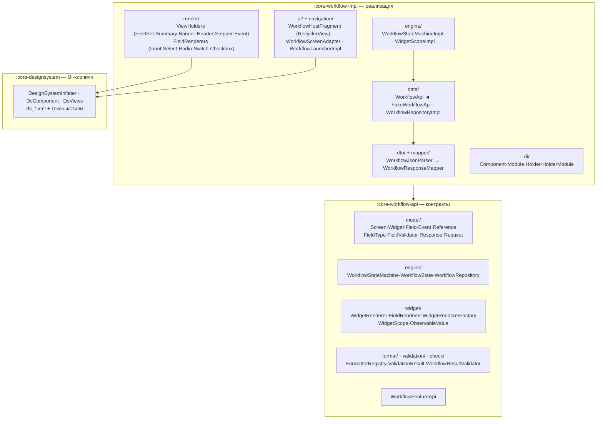
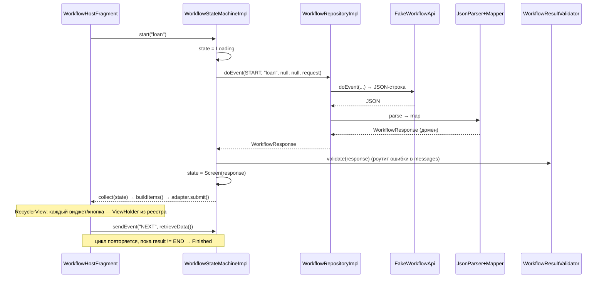
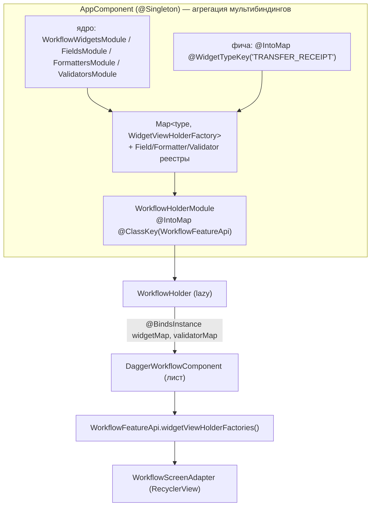

# Server-Driven UI (`core-workflow`) — архитектура

Движок **Server-Driven UI**: сервер присылает JSON-описание экрана (виджеты → поля →
валидаторы → события), клиент его рендерит компонентами дизайн-системы, собирает ввод и шлёт
событие назад — сервер отвечает следующим экраном. Построен на DI-реестре `FeatureHolder` этого
проекта и корутинах. Бэкенд сейчас **фейковый** (`FakeWorkflowApi`).

Модули: `:core-workflow-api` (контракты), `:core-workflow-impl` (реализация), `:core-designsystem`
(UI-компоненты, которые инфлейтит рендер). Пакет `az.less.core.workflow`.

---

## 1. Обзор: цикл «событие → экран»

```
start(flow) ──► [Loading] ──► сервер отдаёт ЭКРАН ──► рендер ──► пользователь жмёт событие
   ▲                                                                       │
   └───────────────── следующий экран ◄── сервер ◄── sendEvent(name, fields)
                                          (пока result != END)
```

Ключевая идея: **ядро ничего не знает о конкретном флоу** — всё описывает сервер
в JSON; клиент лишь умеет рисовать типы полей, валидировать и отправлять значения. Конкретный
сценарий (заявка, перевод, анкета) задаётся сервером, а не кодом.

---

## 2. Карта модулей и слои



Слои (сверху вниз — направление зависимостей):

| Слой | Где | Ответственность |
|---|---|---|
| **Домен** | `api/model` | модель экрана (immutable), типы полей, валидаторы, команды |
| **Транспорт/разбор** | `impl/dto` + `mapper` | JSON-строка → DTO → доменные бины (компиляция валидаторов) |
| **Источник** | `impl/data` | `WorkflowApi` (фейк/Retrofit) + `WorkflowRepositoryImpl` |
| **Движок** | `engine` | `WorkflowStateMachine` гоняет цикл, держит состояние/историю |
| **Рендер** | `widget` + `impl/render` + `ui` | RecyclerView + ViewHolder'ы из реестра; поля через реестр FieldRenderer; сбор ввода |
| **Формат/валидация/ошибки** | `format`/`validation`/`check` | server↔ui форматтеры, проверка полей, разбор ошибок ответа |
| **Дизайн-система** | `:core-designsystem` | переиспользуемые компоненты, инфлейт по ключу |

### Зависимости Gradle

| Модуль | Зависит от |
|---|---|
| `:core-workflow-api` | `api(:core-di)`, `api(fragment-ktx)`, `api(coroutines)` |
| `:core-workflow-impl` | `api(:core-workflow-api)`, `:core-di`, **`:core-designsystem`**, androidx/coroutines, dagger+kapt |
| `:core-designsystem` | appcompat, material, core-ktx (leaf UI-lib, без DI) |
| `:app` | `:core-workflow-impl` (его холдер в общем графе) |

---

## 3. Поток данных

### Основной цикл



### Двусторонняя привязка ввода — `ObservableValue`

Чтобы UI и модель не зациклились (вьюха перезаписывает сама себя), у значения две группы
подписчиков:

- `updateFromUi(v)` — ввод пользователя → уведомляет **модель** (`observe`);
- `update(v)` — программно/из модели → уведомляет **вьюху** (`observeUi`).

Рендерер пишет ввод через `updateFromUi`; хост кладёт ошибку через `errorHolder.update(text)`,
а блок ошибки компонента подписан на неё через `observeUi`.

---

## 4. JSON-контракт

> Полная спека для бэкенда (команды, машина состояний, регионы, словарь, нюансы) —
> **`WORKFLOW-PROTOCOL.md`**. Ниже — краткая выжимка.

Экран несёт три региона виджетов: `screen.header[]` (закреплённая шапка), `screen.widgets[]` (тело),
`screen.footer[]` (закреплённый подвал). **Ответ сервера** (`WorkflowJsonParser` → `WorkflowResponseMapper`):

```jsonc
{
  "body": {
    "result": "SCREEN",              // SCREEN | END
    "pid": "PID-LOAN",                  // id процесса
    "flow": "loan",
    "state": "applicant",            // текущий шаг (эхом возвращается в запросе)
    "screen": {
      "title": "…", "description": "…",
      "widgets": [
        { "type": "FIELDSET", "title": "…", "fields": [
          { "id": "fullName", "type": "TEXT", "title": "ФИО",
            "value": "", "referenceId": null, "style": null,
            "readonly": false, "masked": false,
            "validators": [ { "type": "REQUIRED", "value": "", "message": "…" } ] }
        ]}
      ]
    },
    "events":   [ { "name": "NEXT", "title": "Далее", "type": "SUBMIT", "hidden": false } ],
    "references": { "genders": [ { "id": "M", "text": "Мужской" } ] },
    "fieldMessages": { "age": { "type": "ERROR", "text": "…" } },  // ошибки под полями
    "messages": [ { "type": "INFO", "text": "…" } ]                 // экранные сообщения
  }
}
```

**Запрос клиента** (`WorkflowRequest`): системные атрибуты + значения полей.

```jsonc
{ "document": { "flow": "loan", "state": "applicant", "documentId": "PID-LOAN" },
  "fields":   { "fullName": "Иван", "age": "30", "gender": "M" } }
```

Типы полей: `TEXT, INTEGER, DECIMAL, MONEY, DATE, PHONE, SELECT, CHECKBOX` (неизвестный →
`UNKNOWN` → read-only). Типы валидаторов: `REQUIRED, MIN_LENGTH, MAX_LENGTH, REGEXP,
MIN_VALUE, MAX_VALUE` (числовые — только для числовых полей, см. `WorkflowResponseMapper`).

---

## 5. Сценарии (с JSON)

### S1 — полный 2-шаговый флоу «заявка на кредит»

**Шаг 1.** `start("loan")` → `doEvent(START, …)`. Сервер (`FakeWorkflowApi`) отдаёт экран
«Анкета»:

```jsonc
{ "body": { "result": "SCREEN", "pid": "PID-LOAN", "flow": "loan", "state": "applicant",
  "screen": { "title": "Заявка на кредит", "description": "Шаг 1 из 2 — анкета",
    "widgets": [ { "type": "FIELDSET", "title": "О заёмщике", "fields": [
      { "id": "fullName", "type": "TEXT", "title": "ФИО",
        "validators": [ {"type":"REQUIRED","message":"Укажите ФИО"},
                        {"type":"MIN_LENGTH","value":"3","message":"Минимум 3 символа"} ] },
      { "id": "age", "type": "INTEGER", "title": "Возраст",
        "validators": [ {"type":"REQUIRED","message":"Укажите возраст"},
                        {"type":"MIN_VALUE","value":"18","message":"Только с 18 лет"},
                        {"type":"MAX_VALUE","value":"120","message":"Проверьте возраст"} ] },
      { "id": "gender", "type": "SELECT", "title": "Пол", "referenceId": "genders",
        "validators": [ {"type":"REQUIRED","message":"Выберите пол"} ] } ] } ] },
  "events": [ {"name":"NEXT","title":"Далее","type":"SUBMIT"} ],
  "references": { "genders": [ {"id":"M","text":"Мужской"}, {"id":"F","text":"Женский"} ] } } }
```

Рендер: карточка ДС (`CARD`) с заголовком (`SECTION_HEADER`) и тремя компонентами —
`TEXT_FIELD`, `TEXT_FIELD`(числовой), `SELECT_FIELD`; кнопка `BUTTON` «Далее».

**Шаг 2.** Пользователь заполнил, жмёт «Далее» → клиент валидирует поля локально →
`sendEvent("NEXT", {fullName:"Иван", age:"30", gender:"M"})`:

```jsonc
// запрос
{ "document": {"flow":"loan","state":"applicant","documentId":"PID-LOAN"},
  "fields": {"fullName":"Иван","age":"30","gender":"M"} }
```

Сервер отдаёт экран «Контакты» (`state:"contacts"`, поля `phone`/`PHONE`, `birthDate`/`DATE`,
`income`/`MONEY`, `agree`/`CHECKBOX`; события `BACK`(ROLLBACK) и `SUBMIT`).

**Шаг 3.** `sendEvent("SUBMIT", {phone, birthDate, income, agree})` → сервер завершает флоу:

```jsonc
{ "body": { "result": "END", "pid":"PID-LOAN", "flow":"loan", "state":"done",
  "messages": [ {"type":"INFO","text":"Заявка принята! Решение придёт в push."} ] } }
```

Движок → `WorkflowState.Finished`; хост показывает INFO-тост и закрывает флоу (`popBackStack`).

### S2 — SELECT со справочником

Поле `gender` имеет `referenceId: "genders"`; справочник лежит в `references`. `SelectFieldRenderer`
инфлейтит `SELECT_FIELD`, по клику открывает `AlertDialog` со списком `text`, в `WidgetScope`
пишет выбранный `id` (`updateFromUi("M")`), показывает `text`. На сервер уходит `gender: "M"`.

### S3 — клиентская валидация блокирует submit

Поле пустое/короткое → перед отправкой `WorkflowHostFragment.validate()` гоняет
`FieldValidators.validate(field.validators, value)`; первый провал кладётся в `errorHolder`
поля, компонент показывает текст под собой, `sendEvent` **не вызывается**.

```jsonc
// fullName = "Ан" → срабатывает MIN_LENGTH(3)
{ "valid": false, "error": "Минимум 3 символа" }   // ValidationResult
```

### S4 — серверные ошибки (контракт; фейк их не шлёт)

Если сервер вернул ошибки, `WorkflowResultValidator.validate()` раскидывает их по каналам:
`type:"ERROR"` → error-handler (показать, остаться на экране), и есть `fieldMessages` под поля.

```jsonc
{ "body": { "result": "SCREEN", "state": "applicant", "screen": { /*…тот же экран…*/ },
  "fieldMessages": { "age": { "type": "ERROR", "text": "Возраст не подтверждён" } },
  "messages":      [ { "type": "ERROR", "text": "Исправьте отмеченные поля" } ] } }
```

`validate()` вернёт `false` → движок оставит текущий экран, ошибки уйдут в `messages`-поток → тосты.

### S5 — фатальная ошибка

```jsonc
{ "body": { "result": "SCREEN", "messages": [ { "type": "FATAL", "text": "Сервис недоступен" } ] } }
```

`type:"FATAL"` → fatal-handler → `WorkflowUserMessage(fatal=true)` → хост показывает сообщение и
закрывает флоу.

### S6 — server-driven выбор компонента дизайн-системы

Сервер может задать вариант компонента через `field.style` (имя `DsComponent`). Пример: обычное
`DECIMAL`-поле, но сервер хочет денежный компонент с суффиксом «₽»:

```jsonc
{ "id": "income", "type": "DECIMAL", "title": "Доход", "style": "MONEY_FIELD" }
```

`InputFieldRenderer` берёт `DsComponent.from(field.style)` (если input-совместим) вместо дефолта —
инфлейтится `ds_money_field.xml`. Это и есть «сервер выбирает компонент дизайн-системы».

---

## 6. DI-сборка и расширяемость (продакшен)

Расширяемость — через **Dagger-мультибиндинги**, агрегируемые в `AppComponent` (единственный
компонент, видящий все модули) и прокидываемые в граф workflow через `@BindsInstance`. Без
кодогена: любой модуль (ядро или фича) регистрирует свой вклад `@IntoMap`.

Четыре реестра (`Map<String, …>` по строковому ключу типа):

| Реестр | Ключ | Контракт | Модуль ядра | Где собирается |
|---|---|---|---|---|
| Вьюхолдеры виджетов | `widget.type` | `WidgetViewHolderFactory` | `WorkflowWidgetsModule` | AppComponent |
| Рендереры полей | `field.type` | `FieldRenderer` | `WorkflowFieldsModule` | AppComponent |
| Форматтеры | `field.type` | `ValueFormatter` | `WorkflowFormattersModule` | AppComponent |
| Компиляторы валидаторов | `validator.type` | `ValidatorCompiler` | `WorkflowValidatorsModule` | AppComponent |



Форматтеры/рендереры-полей живут в AppComponent (их потребляют фабрики вьюхолдеров там же);
в граф workflow (`@BindsInstance`) уходят только `Map<widget.type, WidgetViewHolderFactory>` (для
адаптера) и `Map<validator.type, ValidatorCompiler>` (для маппера).

Скоупы: `WorkflowStateMachine`/`WorkflowResultValidator` — **без скоупа** (свежие на каждый
`newStateMachine()`); `WorkflowLauncher` — `@PerFeature`; реестры — `@Singleton` (AppComponent).

---

## 7. Рендер: 3 региона (header/body/footer) + RecyclerView + ViewHolder

Экран рисуется в **три региона** (header/main/footer): закреплённый **header** (степпер +
заголовок + `screen.header`-виджеты), скроллируемый **body** (`screen.widgets` в RecyclerView) и
закреплённый **footer** (`screen.footer`-виджеты + кнопки-события). Body резолвится через
`WorkflowScreenAdapter` (`typeKey → WidgetViewHolderFactory` + стабильный `viewType`); header/footer
рендерятся **теми же фабриками** напрямую (без RecyclerView). Контракт регионов для бэка — в
**`WORKFLOW-PROTOCOL.md`**.

Уровни рендера:

- **Виджет = строка RecyclerView** → `WidgetViewHolder` из реестра по `widget.type`:
  `FIELDSET` (карточка с полями), `SUMMARY` (строки label↔value), `BANNER` (info/success),
  плюс структурные `HEADER`/`STEPPER`/`EVENT` (кнопка primary/secondary).
- **Поле внутри FIELDSET** → `FieldRenderer` из реестра по `field.type`; инфлейтит компонент ДС и
  биндит ввод в `WidgetScope`:

  | FieldType | FieldRenderer | DsComponent |
  |---|---|---|
  | TEXT/INTEGER/DECIMAL/PHONE | `InputFieldRenderer` | `TEXT_FIELD` |
  | MONEY | `InputFieldRenderer` | `MONEY_FIELD` (или `AMOUNT_FIELD` через `style`) |
  | DATE | `InputFieldRenderer` | `DATE_FIELD` |
  | SELECT | `SelectFieldRenderer` | `SELECT_FIELD` |
  | RADIO | `RadioFieldRenderer` | `RADIO_FIELD` |
  | CHECKBOX | `CheckboxFieldRenderer` | `CHECKBOX_FIELD` |
  | SWITCH | `SwitchFieldRenderer` | `SWITCH_FIELD` |

`field.style` может server-driven переопределить компонент (см. S6). Контракт биндинга — стабильные
id ДС, доступ только через `DsViews`. Кнопки-события дёргают `WorkflowInteraction` (submit→валидация
+ отправка / rollback). Палитра компонентов — в `CORE/designsystem/README.md`.

---

## 8. Точки расширения

Всё расширяется **регистрацией в реестр через `@IntoMap`** (модуль включается в `app/AppHolderModule`)
— ядро трогать не нужно:

| Хочу | Что сделать |
|---|---|
| Новый **виджет** (вкл. из фичи) | `WidgetViewHolderFactory` + `@Binds @IntoMap @WidgetTypeKey("MY_TYPE")`. Пример — `TRANSFER_RECEIPT` из `feature-transfer` |
| Новый **тип поля** | `FieldRenderer` + `@Binds/@Provides @IntoMap @StringKey("MY_FIELD")` |
| Новый **форматтер** | `ValueFormatter` + `@IntoMap @StringKey("MY_FIELD")` |
| Новый **тип валидатора** | `ValidatorCompiler` + `@IntoMap @StringKey("MY_VALIDATOR")` |
| Новый **компонент ДС** | `ds_*.xml` + значение в `DsComponent` + ветка в `DesignSystemInflater` (+ `DsViews`) |
| **Реальный бэкенд** | заменить `@Binds FakeWorkflowApi` на Retrofit-реализацию `WorkflowApi` (Retrofit из `NetworkCoreApi`) |

---

## 9. Жизненный цикл

Движок **короткоживущий** — один `WorkflowStateMachineImpl` на запуск флоу (`newStateMachine()`):
держит собственный `CoroutineScope` (Main.immediate), `StateFlow` состояния и локальную историю
экранов для `rollback` (шаг «назад» без обращения к серверу). Создаётся в `WorkflowHostFragment`.
Само ядро (`WorkflowFeatureApi`) поднимается лениво через `FeatureHolder` при первом
`api<WorkflowFeatureApi>()` (как все ядра проекта, см. `ARCHITECTURE.md` §8).

---

## 10. Известные ограничения

1. **Rotation/process death** — состояние движка не сохраняется (создаётся заново, флоу
   стартует с начала). Нужен `SavedStateHandle`/persistence.
2. **Фейковый бэкенд** — `FakeWorkflowApi` знает 4 демо-флоу (loan/profile_edit/feedback/transfer); реальная сеть не подключена (swappable на Retrofit).
3. **Ограниченный набор типов полей** — неизвестные типы рендерятся read-only.
4. **kapt** (fallback на Kotlin 1.9) — мигрировать на KSP.
5. Field-messages не привязываются к конкретным полям (показываются как экранные).
6. Один экран на ответ сервера (мульти-экранные ответы не поддерживаются).

---

## 11. Как запустить демо

```powershell
$env:JAVA_HOME = "C:\Program Files\Android\Android Studio\jbr"
.\gradlew.bat :app:assembleDebug
```

Демо-флоу запускаются из разных экранов фич (фейк-сервер диспетчеризует по имени флоу,
константы — в `WorkflowFlows`):

| Экран фичи | Кнопка | Флоу | Что показывает |
|---|---|---|---|
| Профиль | «Редактировать профиль (SDUI)» | `PROFILE_EDIT` | 1 экран, предзаполнение (`value`), REGEXP-валидация e-mail, PHONE-форматтер |
| Каталог | «Оставить отзыв (SDUI)» | `FEEDBACK` | 1 экран, SELECT со звёздами, CHECKBOX, MIN_LENGTH |
| Настройки | «Открыть заявку (SDUI)» | `LOAN` | 2 экрана (анкета → контакты), MONEY/DATE, rollback «Назад» |
| Профиль | «Перевести деньги (SDUI)» | `TRANSFER` (фича целиком SDUI) | 4 шага + успех, степпер, RADIO-счёт, AMOUNT, SWITCH, SUMMARY, BANNER, **кастомный виджет фичи `TRANSFER_RECEIPT`** |

**`feature-transfer` — целиком server-driven фича**: у неё нет своих экранов/репозитория, лаунчер
лишь открывает SDUI-флоу `transfer`. Свой виджет «квитанция» (`TRANSFER_RECEIPT`) она регистрирует в
реестр ядра через `@IntoMap @WidgetTypeKey` — ядро его кода не содержит (доказательство расширяемости).
`FakeWorkflowApi` для transfer накапливает поля по шагам (stateful) и строит summary/успех динамически.

Поля отрисованы компонентами дизайн-системы, клиентская валидация показывает ошибки под полями,
на финале — INFO-тост и закрытие флоу.
